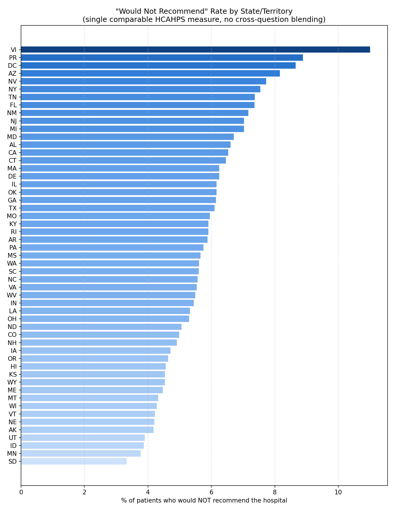
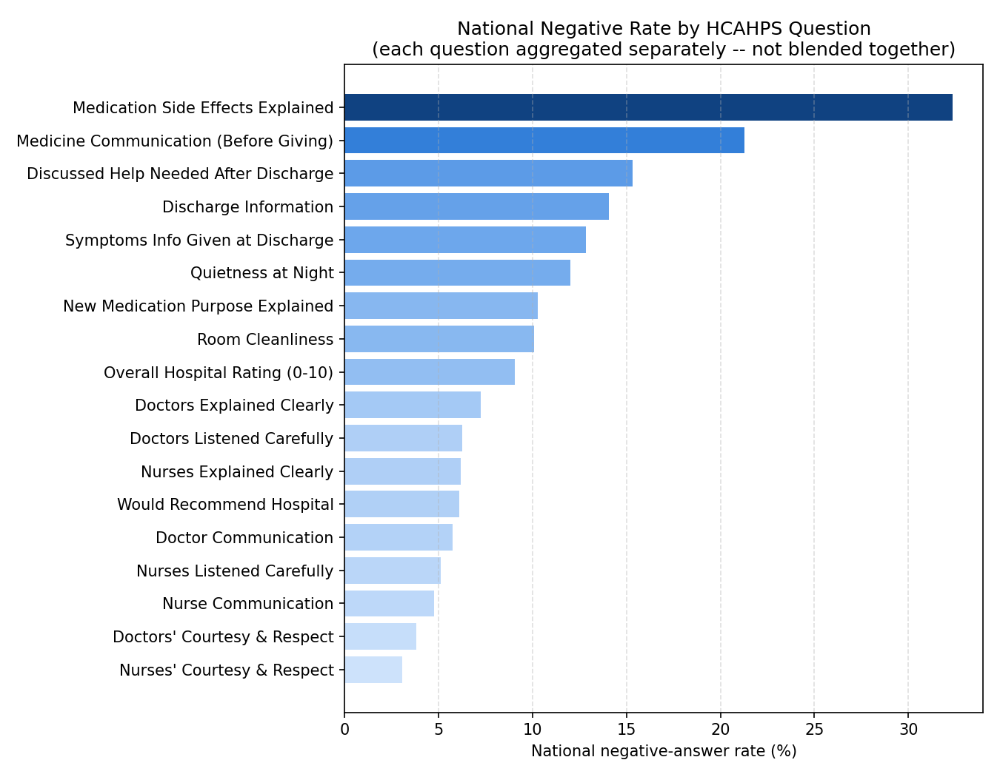
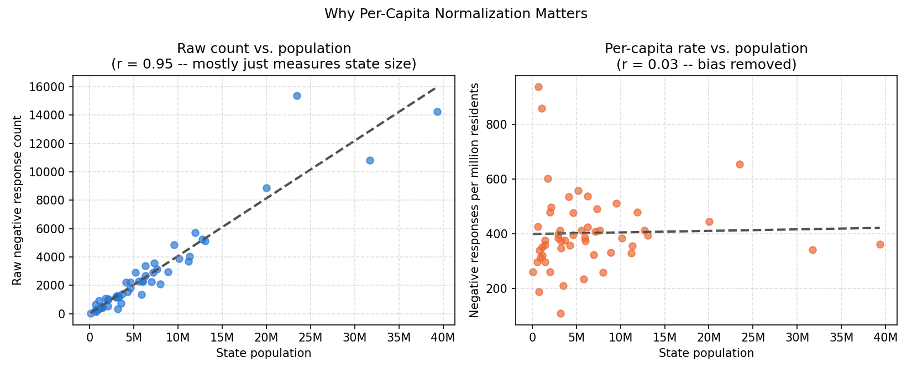
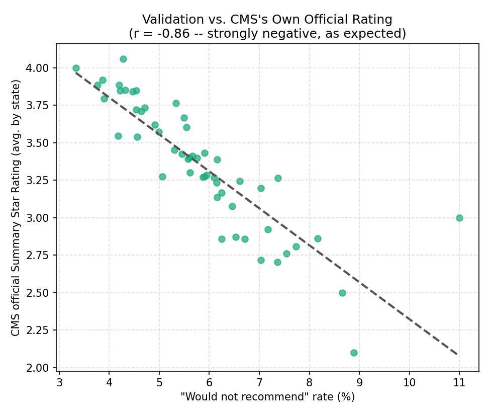

# HCAHPS Hospital Patient Experience: Sentiment Analysis

A data engineering project that turns the CMS HCAHPS national patient-experience survey into labeled sentiment data and state-level insights, with statistical validation against CMS's own official ratings.

## Overview

HCAHPS is the standardized U.S. survey CMS uses to capture patients' perspectives on hospital care: communication with doctors and nurses, cleanliness, quietness, discharge information, medication communication, and overall hospital ratings. The raw source data doesn't report this as a simple positive or negative label. It reports categorical answer descriptions (e.g., *"Nurses 'always' communicated well"*) alongside percentages, star ratings, and survey counts.

This project turns that raw categorical data into something analyzable, and answers two questions:

1. **What sentiment does each survey answer category represent?** (positive / neutral / negative)
2. **Where do patients report the most negative experiences,** in absolute terms, as a rate, and normalized per capita?

## Technical Approach

**1. Sentiment Labeling (Domain Knowledge Engineering)**
HCAHPS answers are pre-categorized, not free text, so sentiment isn't inferred by a model here. It's derived from a manual mapping dictionary that classifies all ~70 unique HCAHPS answer descriptions into positive, negative, or neutral (aggregate metrics like linear mean scores and star ratings, which aren't sentiment-bearing on their own). Labels are encoded numerically (positive = 1, neutral = 0, negative = -1) for downstream aggregation.

**2. Feature Engineering & Estimation**
Cleans and casts numeric fields (answer percentages, completed survey counts, star ratings, response rates), then derives `estimated_responses = answer_percent * completed_surveys / 100` to approximate the number of patients behind each reported percentage.

**3. Geographic Rollup**
Each HCAHPS survey batch answers ~18 distinct questions (nurse communication, doctor communication, cleanliness, quietness, discharge info, recommend-hospital, etc.), all sharing the same respondent base. Estimated responses are first aggregated **per question** (grouped by the underlying `HCAHPS Measure ID`, e.g. `H_COMP_1_A_P`/`H_COMP_1_SN_P`/`H_COMP_1_U_P` all roll up to `H_COMP_1`) so unrelated questions are never summed together, which would otherwise inflate counts by ~18x and blend dissimilar sentiment dimensions into one meaningless number. The full per-question, per-state breakdown is saved for granular analysis, and a single well-defined, mutually-exclusive question — "would recommend the hospital" (`H_RECMND`) — is used as the headline, apples-to-apples state comparison. That headline metric is then joined against a state/territory population reference table (all 50 states, DC, and PR/VI/GU/AS/MP) to normalize per million residents rather than ranking by raw volume, which would just reflect population size. The pipeline explicitly checks the correlation between negative response volume and state population to surface that bias, and flags any states with missing population data for transparency.

## Key Findings (Visualized)



Puerto Rico, DC, and Arizona have the highest share of patients who would not recommend their hospital; South Dakota, Minnesota, and Idaho have the lowest. This uses a single, apples-to-apples HCAHPS question so states are never compared across blended, unrelated measures.



Not all HCAHPS dimensions are equally negative nationally: medication side-effect communication (32%) and pre-medication communication (21%) are the weakest-performing measures by far, while nurse and doctor courtesy/respect are consistently strong (3-4%). This is exactly why the state ranking above uses one specific measure instead of summing every question together.



Raw negative-response counts correlate almost perfectly with state population (r = 0.95) — bigger states simply have more hospitals and more patients, not necessarily worse care. Once normalized per million residents, that correlation disappears (r = 0.03), confirming the per-capita metric is actually comparing care quality rather than population size.



As a sanity check, the derived "would not recommend" rate is compared against CMS's **own** official per-hospital Summary Star Rating (averaged by state) — not an unrelated third-party index. The two move together strongly (r = -0.86): states with a higher share of negative recommend-hospital answers reliably have a lower official CMS star rating, confirming the pipeline's output is internally consistent with CMS's own authoritative rating.

Regenerate these charts anytime with `python hcahps_visualization.py` (requires `hcahps_sentiment_analysis.py` to have been run first to produce the underlying CSVs).

## Scope & Comparability

This project measures **patient-reported experience** during a hospital stay (communication, cleanliness, quietness, discharge information, and whether patients would recommend the hospital) — nothing more. It does **not** measure, and should not be compared directly against, broader "best/worst state healthcare" rankings (e.g., WalletHub-style rankings referenced by outlets like Business Insider), which blend dozens of unrelated variables such as insurance coverage rates, physician access, cost of care, and public-health outcomes. Two states can have identical HCAHPS patient-experience scores while differing enormously on access or cost, and vice versa — this is well documented in health services research, where CMS star ratings, HCAHPS, Leapfrog safety grades, and U.S. News rankings routinely disagree because they measure different things. The correct way to validate this project's numbers is against CMS's own official metrics (see the validation chart above), not against composite indices built from unrelated data sources.

## Repository Contents

| File | Role |
|---|---|
| `HCAHPS-Hospital.csv` | Raw CMS source data (per-hospital HCAHPS survey results, national scope) |
| `hcahps_sentiment_analysis.py` | Core pipeline: maps answer descriptions to sentiment, estimates response volumes, aggregates by state, joins population for per-capita analysis |
| `hcahps_utils.py` | Shared, unit-testable logic (measure-group derivation, response estimation, state aggregation, population join) used by the pipeline |
| `test_hcahps_utils.py` | Automated tests for `hcahps_utils.py` (run with `python -m unittest test_hcahps_utils.py -v`) |
| `hcahps_visualization.py` | Generates the charts in `visuals/` from the state-level CSV outputs |
| `HCAHPS-Hospital-sentiment.csv` | Output: full dataset enriched with sentiment labels, numeric encodings, and estimated response counts |
| `HCAHPS-Hospital-state-negative-by-measure.csv` | Output: negative-rate breakdown by state **and** individual HCAHPS question (no cross-question blending) |
| `HCAHPS-Hospital-state-negative-summary.csv` | Output: headline state-level rollup based on the "recommend hospital" question only, with per-million-population normalization and a validation column against CMS's own official Summary Star Rating |
| `visuals/` | Output: PNG charts generated by `hcahps_visualization.py` |

## Skills Demonstrated

- **Real-world data engineering:** handling a 50MB+ national government dataset with inconsistent numeric formatting (percentages, commas, mixed types)
- **Domain-driven labeling:** converting a categorical survey taxonomy into ML-ready sentiment labels without manual text annotation
- **End-to-end pipeline thinking:** raw ingestion, cleaning, feature engineering, statistical aggregation, geographic normalization, and exportable analytical outputs
- **Statistical rigor:** normalizing by population instead of raw counts, and explicitly testing for a known analytical bias before trusting the results

## Tech Stack

Python, pandas, matplotlib

## Setup & Reproducibility

Requires Python 3.10+.

```
pip install -r requirements.txt
```

1. Download the HCAHPS Hospital dataset (see Data Source below) and place it in the project root as `HCAHPS-Hospital.csv`. It's excluded from this repo via `.gitignore` because it's 100MB+.
2. `python hcahps_sentiment_analysis.py` — runs the core pipeline and writes the CSV outputs.
3. `python hcahps_visualization.py` — generates the charts in `visuals/` from those outputs.
4. `python -m unittest test_hcahps_utils.py -v` — runs the unit test suite (does not require the raw CSV).

## Data Source

Source data is the public CMS (Centers for Medicare & Medicaid Services) "Patient survey (HCAHPS) - Hospital" dataset, available through the CMS Provider Data Catalog: https://data.cms.gov/provider-data/dataset/dgck-syfz. It's aggregated and de-identified at the source; no individual patient records are included or accessible through this dataset.

## Methodology Notes & Known Limitations

- **Suppressed data:** ~41% of raw `HCAHPS Answer Percent` values are CMS-suppressed (`"Not Applicable"` or `"Not Available"`, typically small-sample facilities) and are excluded from aggregates via coercion to `NaN`. Roughly 87k rows also carry a CMS data-quality footnote that isn't currently surfaced in the outputs.
- **Population figures are sourced and cited:** the 50 states, DC, and Puerto Rico use U.S. Census Bureau Vintage 2025 postcensal estimates (as of July 1, 2025, NST-EST2025-POP). Guam, the U.S. Virgin Islands, American Samoa, and the Northern Mariana Islands aren't part of that annual program, so they use the 2020 Decennial Census island-area counts instead — both sources are cited directly above `state_population_map` in `hcahps_sentiment_analysis.py`.
- **Correlation between state population and negative response volume is expected to be high** (larger states simply have more hospitals and respondents); this is why the headline metric is normalized per million residents rather than presented as a raw count.

## Testing

The measure-group derivation, response-estimation, state aggregation, and population-join logic used by `hcahps_sentiment_analysis.py` live in `hcahps_utils.py` and are covered by 18 unit tests in `test_hcahps_utils.py`, including a regression test that guards against the original cross-question double-counting bug. Run them with:

```
python -m unittest test_hcahps_utils.py -v
```

## Future Enhancements

- Replace the manual sentiment dictionary with a validated lookup table or automated tests to catch silent mismatches as CMS updates category wording
- Refresh the state population figures on a yearly cadence as new Census Bureau vintages are released
- Containerize the pipeline (Docker) and orchestrate scheduled CMS data refreshes with a workflow tool (Airflow or Prefect)

## License

This project is licensed under the MIT License. See the LICENSE file for details.
